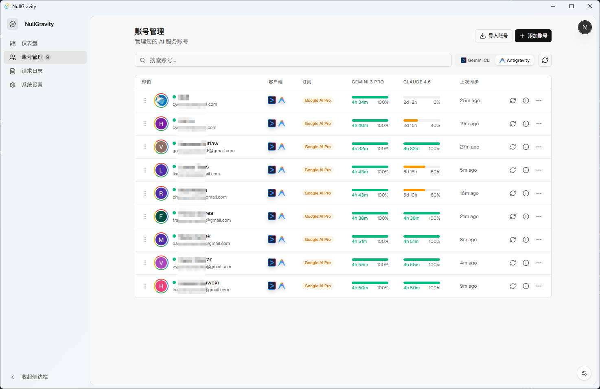
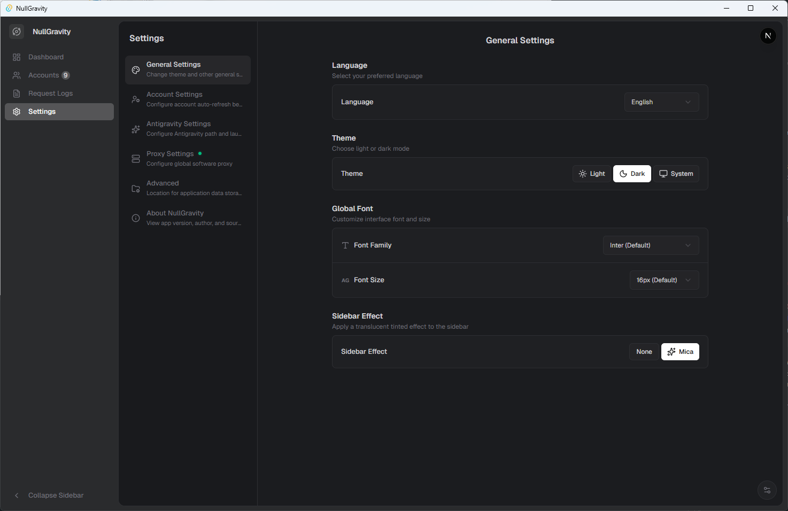

<div align="center">

# NullGravity


NullGravity 是一个综合性的 AI 账号管理与协议代理系统。它提供了一个统一的仪表盘，用于监控账号健康状态、处理 Google OAuth 认证，并与 Antigravity 集成。

[English](./README.md) | [简体中文](./README_zh.md)

</div>

---

## 🚀 概览


NullGravity 结合了 Web 和桌面技术，提供统一的使用体验。

### 核心功能
- **账号管理**: 集中管理 AI 账号，支持设备指纹隔离与 Google OAuth 认证。
- **代理系统**: 内置可配置的上游代理设置，确保网络连接畅通与隐私安全。
- **Antigravity 集成**: 自动探测、启动管理以及清理外部 Antigravity 应用实例的缓存。
- **实时监控**: 可视化仪表盘，实时展示请求日志、调用成功率及账号配额状态。

<div align="center">
  
  
</div>

---

## 🛠️ 技术栈

本项目主要使用了以下技术：

| 领域 | 技术 |
| :--- | :--- |
| **桌面端** | [Tauri v2](https://tauri.app/) |
| **前端** | [React 19](https://react.dev/), [Next.js 16](https://nextjs.org/), [Vite](https://vitejs.dev/) |
| **样式** | [Tailwind CSS v4](https://tailwindcss.com/), [Shadcn UI](https://ui.shadcn.com/), [Ant Design](https://ant.design/) |
| **后端** | [Python](https://www.python.org/) |
| **AI** | [Google Gemini](https://deepmind.google/technologies/gemini/) |

---

## 💻 快速开始

本项目以工作区（Workspace）形式组织。每个组件都可以独立运行。

### 先决条件
- **Node.js**: v20+ (推荐)
- **Python**: 3.10+

### 安装

1.  **克隆仓库**:
    ```bash
    git clone https://github.com/your-username/NullGravity.git
    cd NullGravity
    ```

2.  **进入项目目录** (例如核心应用):
    ```bash
    cd app
    npm install
    ```

3.  **运行开发服务器**:
    ```bash
    npm run dev
    # 或者运行 Tauri 开发模式
    npm run tauri dev
    ```


---

## 📄 许可证

本项目采用 **知识共享 署名-非商业性使用-相同方式共享 4.0 国际许可协议 (CC BY-NC-SA 4.0)** 进行许可。

---

<div align="center">
  <sub>由 NullGravity 团队 ❤️ 构建</sub>
</div>
